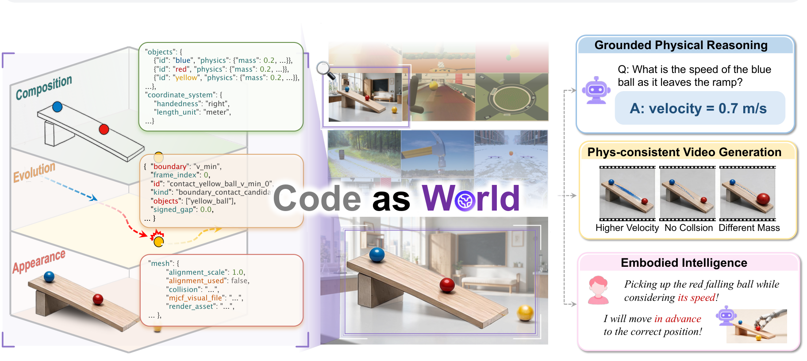

<p align="center">
  
</p>

<h1 align="center">Code-as-World</h1>
<p align="center">
  <b>Agentic Discovery of Executable World Representations for
Physical Reasoning</b>
</p>

<p align="center">
  <i>A world becomes intelligible to evolving intelligence when it can be represented, executed, and verified.</i>
</p>

<p align="center">
  <a href="TODO(arxiv-link)"></a>
  <a href="https://mirros-lab.github.io/code-as-world"></a>
  <a href="https://mirros.ai/blog/representing-physical-world"></a>
  <a href="https://github.com/mirros-lab/code-as-world"></a>
</p>

<!-- <p align="center">
  <a href="#overview">Overview</a> |
  <a href="#how-it-works">Method</a> |
  <a href="#discovery-modes">Discovery Modes</a> |
  <a href="#results">Results</a> |
  <a href="#applications">Applications</a> |
  <a href="#citation">Citation</a>
</p> -->

<p align="center">
  
</p>

## Overview

Pixels are **evidence** of the physical world, not its **ontology**. A pixel-level observation records how the world appears at a particular moment and from a particular viewpoint, but does not directly specify what exists within it, how it is structured, or what governs its evolution.

**Code-as-World** introduces code as executable representations for the physical world and an agentic process for discovering them through iterative simulation and verification. In doing so, it turns raw abundant observations into reusable physical data: explicit states, dynamics, and mechanisms that capture not only what was seen, but the **underlying world that could have produced it**. This provides scalable physical supervision, enabling our models to achieve state-of-the-art performance on quantitative physical reasoning.

## News

- [2026/08/27] Code-as-World technical report released.
- [2026/08/27] [MirroS blog](https://mirros.ai/blog/representing-physical-world) and [Project page](https://mirros-lab.github.io/code-as-world) is live.


## TODO

- [ ] Release Code-as-World-VL checkpoints and inference recipes
- [x] Technical report, project page, and blog release

## Acknowledgements

We sincerely thank the teams behind the following projects for making their work available to the community:

| Component | Projects |
|---|---|
| Physical simulation | [MuJoCo](https://github.com/google-deepmind/mujoco) |
| Visual perception and reconstruction | [SAM 3](https://arxiv.org/abs/2511.16719), [VGGT-Omega](https://arxiv.org/abs/2605.15195), [SAM 3D](https://arxiv.org/abs/2511.16624) |
| Realistic video generation | [Wan](https://arxiv.org/abs/2503.20314), VACE |
| Quantitative evaluation | [QuantiPhy](https://quantiphy.stanford.edu/) |

_... and many other excellent open-source projects._

## Citation

If you find Code-as-World useful, please cite:

```bibtex
@article{mirros2026codeasworld,
  title   = {Code as Worlds: Agentic Discovery of Executable World Representations for Physical Reasoning},
  author  = {{MirroS Team}},
  journal = {arXiv preprint arXiv:2608.xxxxx},
  year    = {2026}
}
```

